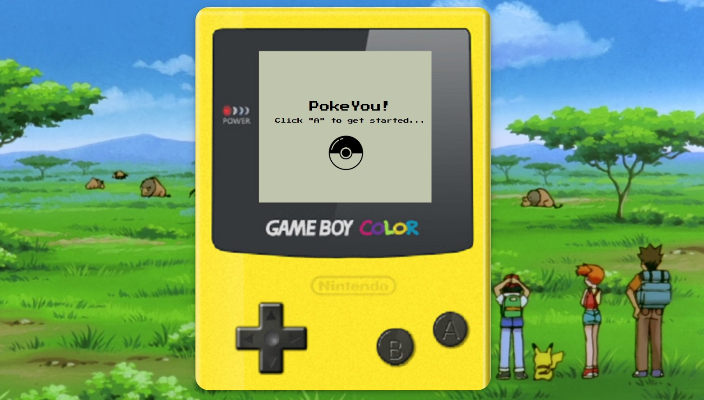
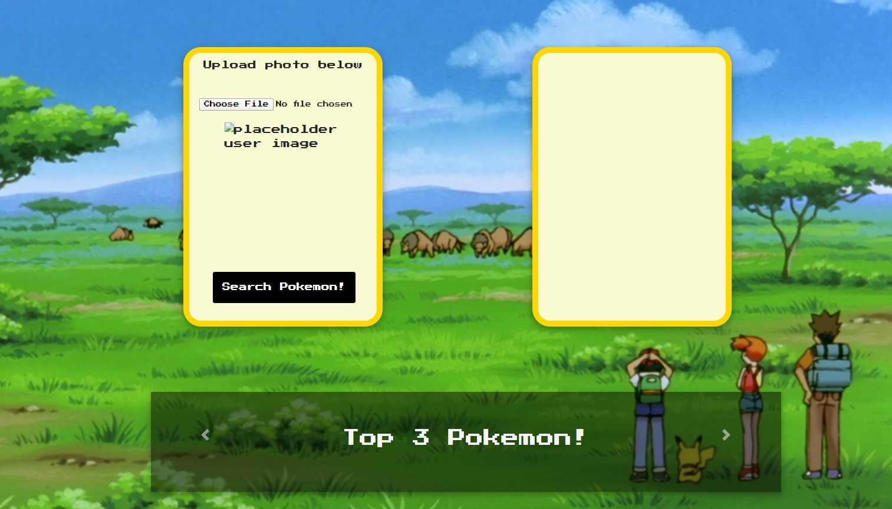

# About PokeYou

PokeYou is an app that allows a user to upload an image of themselves, and then matches them with the pokemon that most resembles their features. Giving them the ability to best match themselves with the first generation of Pokemon.  

The app uses Microsoft's FaceAPI to store users face images, record a number of very basic metrics on each face and group the user's face into a distinct emotional category(registering whether someone is happy, sad, scared, angry, etc.). 

Each emotional category corresponds with a subset of the original 150 Pokemon, one of which is returned as a match to the user. 

# Technology

PokeYou is built on:

- HTML/CSS/Javascript 
- A Bootstrap framework
- Additionally, uploaded images are stored with the use of a media management company called Cloudinary
- Utilized Axios calls to facilitate the transfer of data 
- Then input image into Microsoft's FaceAPI for tracking facial features and comparing them to what was most like a Pokemon. 
- The app also uses the open source PokeApi to retrieve Pokemon statistics, data, and images. 

### Screenshots

